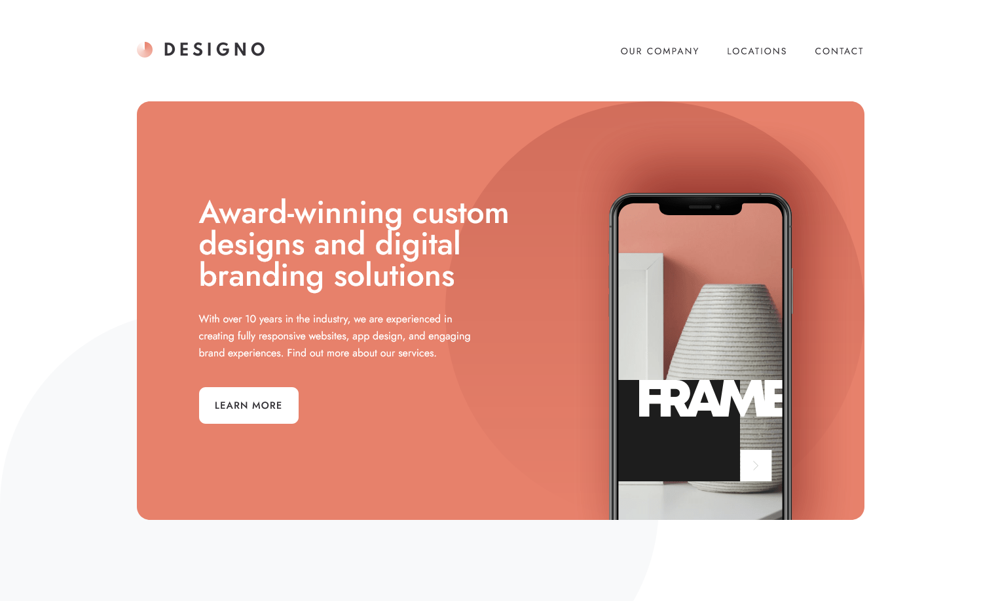
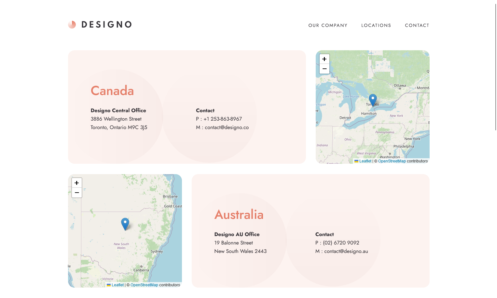

# Frontend Mentor - Designo agency website solution

## Developed with

- Built with:
  - [React](https://reactjs.org/) - JS library
  - [Styled Components](https://styled-components.com/) - For styles
- React Router for routing management
- Formik for form management, ensuring efficient and organized handling of form
  data.
- Leaflet JS for interactive maps

## The challenge

Users should be able to:

- View the optimal layout for each page depending on their device's screen size
- See hover states for all interactive elements throughout the site
- Receive an error message when the contact form is submitted if:
  - The `Name`, `Email Address` or `Your Message` fields are empty should show
    "Can't be empty"
  - The `Email Address` is not formatted correctly should show "Please use a
    valid email address"
- **Bonus**: View actual locations on the locations page maps (we recommend
  [Leaflet JS](https://leafletjs.com/) for this)

## Implementation

In the application, React components are structured with lazy loading to enhance
performance. The project uses:

- React Router for client-side routing to manage navigation within the app.
- Styled Components for writing CSS that's scoped to individual components.
- Formik for handling form state and validation, ensuring smooth and error-free
  form submissions.
- Leaflet JS for rendering interactive maps on the locations page.

The app is configured to scroll to the top of the page on route changes,
ensuring a seamless user experience.

## Future Development

Potential future developments for the application include:

- Backend Integration: Connecting to a backend service for dynamic content and
  data management.
- Blog Section: Adding a blog section to share updates, news, and articles.
- Animations: Enhancing the user interface with animations and transitions for a
  more engaging experience.
- E-commerce Functionality: Implementing features for handling product listings,
  shopping cart, and checkout processes.
- Admin Panel: Creating an admin panel for easy management of website content,
  including adding new projects, updating team information, and handling
  inquiries.

These enhancements will ensure the application remains flexible, scalable, and
able to meet the evolving needs of its users.
